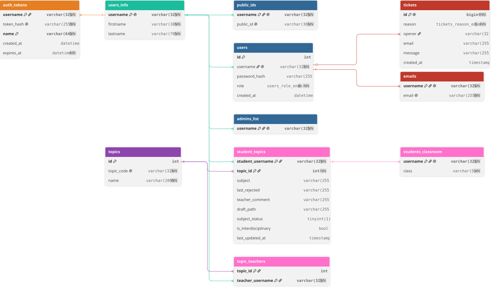

# Goralys

Goralys is a lightweight web app to manage "Grand Oral" topics for students and teachers at a high school.

## Features

- Student/teacher/admin roles with automatic role detection at registration ([
  `AuthController::register`](backend/src/App/User/Controllers/AuthController.php)).
- Two-topic student workflow: draft, submit, and read-only once submitted ([
  `useSubjects`](goralys-core/src/hooks/use-subjects.ts), [
  `SubjectsController`](backend/src/App/Subjects/Controllers/SubjectsController.php)).
- Session-backed user data caching for fast frontend rendering ([
  `AuthController::login`](backend/src/App/User/Controllers/AuthController.php) manages session data).
- CSRF protection using a short-lived session token: [
  `CSRFService`](backend/src/App/Security/CSRF/Services/CSRFService.php) + [
  `fetchCsrfClient`](goralys-core/src/lib/fetch/fetch.client.ts).
- Toast notification system used by both PHP and Next.js ([
  `ToastController::showToast`](backend/src/App/Utils/Toast/Controllers/ToastController.php) and [
  `toast-provider.tsx`](app/src/ui/toast/toast-provider.tsx)).

## Quick start (development)

Prerequisites:

- PHP 8.5+ with mysqli
- Composer
- pnpm package manager

Steps:

To run the app locally, you must first install a reverse proxy like Caddy for the API. Goralys already includes a
pre-configured file for Caddy.

You can install Caddy via ChocoLatey:

```bash
choco install caddy
```

You must also generate a wildcard certificate for the domain `*.goralys.test` (or any other domain you want to use). You
can use mkcert to generate a self-signed certificate:

```bash
# Install mkcert
choco install mkcert
mkcert -install
mkcert -key-file ./.certs/_wildcard.goralys.test+1-key.pem -cert-file ./.certs/_wildcard.goralys.test+1.pem *.goralys.test
```

Finally, you must also map `goralys.test` and its subdomains to your local machine, since this domain does not exist on
the public internet. Edit your hosts file (`C:\Windows\System32\drivers\etc\hosts` on Windows, requires admin rights;
`/etc/hosts` on Linux/macOS, requires `sudo`) and add:

```
127.0.0.1 goralys.test
127.0.0.1 api.goralys.test
127.0.0.1 0492061z.goralys.test
```

> [!NOTE]
> `0492061z` is a sample high school code used for local testing (must exist in your `schools_list` INI file).
> Add one line per high school code you want to test locally.

1. Run setup script:
    ```bash
    .\scripts\setup.bat
    ```
   Or if you use Linux:
    ```bash
    ./scripts/setup.sh
    ```
2. Configure environment:
    - For development, modify the values inside .env (created using setup.bat)
3. Database:
    - Create the database and tables using the schema at [backend/data_structure.sql](backend/data_structure.sql).
4. Run dev server:
    - Run Next and PHP's built-in server for the API. By default, the port for the API is 80:
        ```bash
        C:\php8.5\php.exe -S 127.0.0.1:80 -t C:\Programmation\Goralys\backend\public C:\Programmation\Goralys\backend\public\index.php
        ```
    - Run Caddy:
      ```bash
       caddy run
      ```
    - Run the frontend:
      ```bash
      pnpm dev --experimental-https --experimental-https-key ./.certs/_wildcard.goralys.test+1-key.pem --experimental-https-cert ./.certs/_wildcard.goralys.test+1.pem
      ```
5. Access the app:
    - Visit `https://0492061z.goralys.test:3000` (replace `0492061z` with any high school code configured in your hosts
      file and `schools_list`). Visiting `https://localhost:3000` directly will **not** work — authentication will fail
      since the session cookie is scoped to `.goralys.test`.

> [!IMPORTANT]
> The dev script will automatically deactivate all TLS verification for the Next.js server.
> This should only be used for development purposes.$
> If you use this script for production, your machine will be vulnerable to MITM (man-in-the-middle) attacks.
> Use this consciously.

### Database Schema

Here is a complete overview of the full schema for Goralys:



## Testing

You can use phpunit to run the unit tests for the backend in `backend/tests`. To run the tests, use the following
command after installing the project dependencies with composer:

```bash
.\backend\vendor\bin\phpunit --configuration backend\phpunit.xml
```

### Topic import

To test the topic import system, you can use the test file under the `assets/testing/` folder
([test.zip](assets/testing/test.zip)). This can also help you understand the required format for Goralys topics import.
If your data does not follow this exact format, the system will not be able to import it successfully.

## Security notes

- CSRF:
    - Token validated by [`CSRFService::validate`](backend/src/App/Security/CSRF/Services/CSRFService.php).
- Passwords:
    - Passwords are hashed using PHP's `password_hash` ([
      `RegisterService::register`](backend/src/Core/User/Services/RegisterService.php)) and verified with
      `password_verify` ([`LoginService::login`](backend/src/Core/User/Services/LoginService.php)).
- Sensitive config:
    - You _must_ use `.env` to configure your project.

_Note: the `develop` branch serves as a pre-production playground, so some commits may include experimental or buggy
code — I try to minimize this as much as possible._

## Key code pointers

- Main Kernel (Initialization & Routing): [`GoralysKernel`](backend/src/Kernel/GoralysKernel.php)
- Authentication & Sessions: [`AuthController`](backend/src/App/User/Controllers/AuthController.php)
- Subjects Management: [`SubjectsController`](backend/src/App/Subjects/Controllers/SubjectsController.php)
- Database schema: [backend/data_structure.sql](backend/data_structure.sql)
- Frontend Subject logic: [`useSubjects` hook](goralys-core/src/hooks/use-subjects.ts)
- Toast notification: [`ToastController`](backend/src/App/Utils/Toast/Controllers/ToastController.php) and [
  `toast-provider.tsx`](app/src/ui/toast/toast-provider.tsx)
- CSRF Service: [`CSRFService`](backend/src/App/Security/CSRF/Services/CSRFService.php)

## Project structure

### Frontend (Next.js)

- `app/`: Contains the application pages and logic.
- `app/subject/`: Student, Teacher, and Admin dashboards.
- `app/src/hooks/`: React hooks for data fetching and state management.
- `app/src/ui/`: Reusable UI components.

### Backend (PHP)

- `backend/API/`: API endpoints, acting as entry points for the kernel.
- `backend/src/Kernel/`: The core of the backend, handles initialization and request management.
- `backend/src/App/`: Controllers and application-level services.
- `backend/src/Core/`: Business logic and core domain services.
- `backend/src/Platform/`: Low-level platform services (DB, Logger, Loader).
- `backend/tests/`: Unit and integration tests.

## License and contributing information

This project was originally licensed under the MIT license, as of version 2.1.1, this project is now licensed under the
GNU Affero General Public License v3.0 (see: [`LICENSE`](LICENSE)). Third-party licenses can be found in [
`THIRD-LICENSE-PARTY`](THIRD-PARTY-LICENSE). All contributions are welcome as long as they respect the terms inside [
`Contributing`](CONTRIBUTING.md).

## Notes

Any pull request containing sensitive information inside `.env` will have no chance to be merged.
